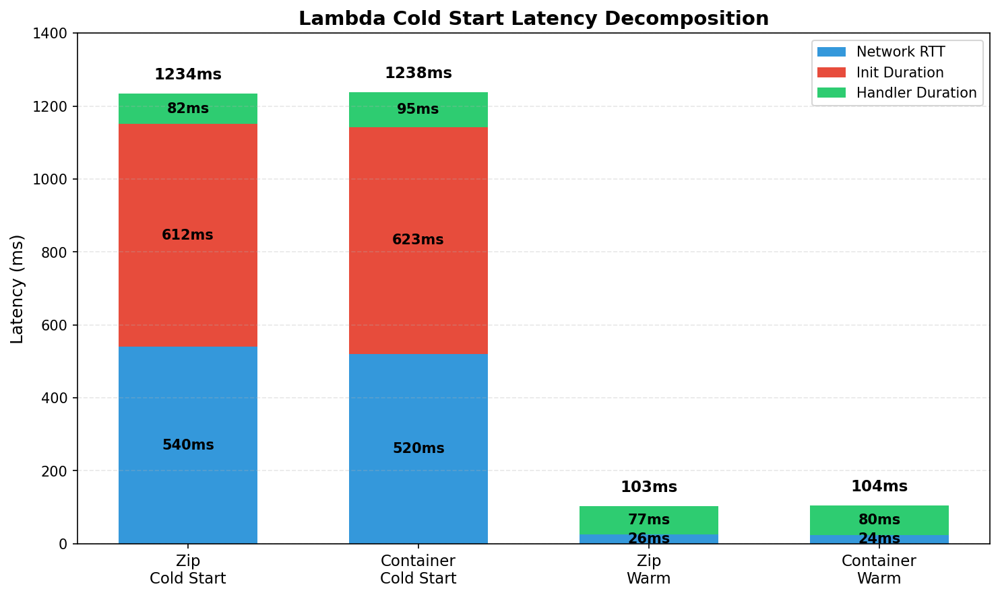
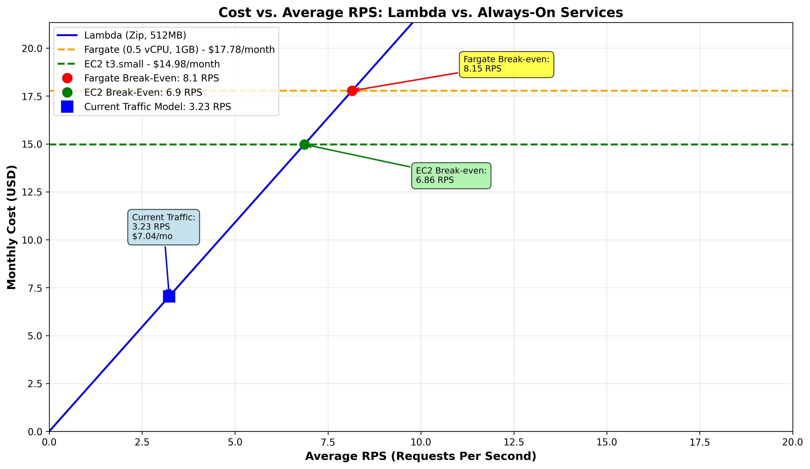

# AWS Cloud Lab

---

## Assignment 1: Deploy All Environments

### Deployment Summary

All four execution environments were successfully deployed following the User Manual:

1. **Lambda (Zip)** — Python 3.12 with NumPy layer, 512MB memory, Function URL with IAM auth
2. **Lambda (Container)** — Same workload in Docker container from ECR
3. **ECS Fargate** — 0.5 vCPU, 1 GB RAM, behind Application Load Balancer
4. **EC2 t3.small** — 2 vCPU, 2 GB RAM, direct HTTP access on port 8080

### Endpoint Verification

All endpoints were tested with the same query vector and returned identical k-NN results, confirming that all environments execute the same workload please refer to `results/assignment-1-endpoints.txt.` for the full output.

---

## Assignment 2: Scenario A — Cold Start Characterization

### Methodology

- Lambda functions idle for 20+ minutes before testing
- Script `scenario-a.sh` was triggered 2 times for the zip and container variant separately.
- Cold starts identified by Init Duration in CloudWatch logs

### Results

| Metric | Zip Cold Start | Container Cold Start | Zip Warm | Container Warm |
|--------|----------------|---------------------|----------|----------------|
| Init Duration | 612 ms | 623 ms | 0 ms | 0 ms |
| Handler Duration | 82 ms | 95 ms | 77 ms | 80 ms |
| Network RTT | 540 ms | 520 ms | 26 ms | 24 ms |
| Total Latency | 1234 ms | 1238 ms | 103 ms | 104 ms |

**Network RTT Calculation:**
- Cold start: `Total client latency - Init Duration - Handler Duration`
- Warm: `Total client latency - Handler Duration`



### Analysis

**Zip vs. Container Cold Starts:**
- Zip is 11 ms faster (612 ms vs. 623 ms Init Duration)
- Zip deployment package (~2 MB) is smaller than container image (~150 MB)
- Container images require additional layer extraction and container startup steps
- Both use identical Python runtime and NumPy library, so handler initialization is the same

**Cold Start Impact:**
- Cold starts add ~1100 ms latency compared to warm invocations
- Network RTT increases significantly during cold starts (540 ms vs. 26 ms) due to Lambda service routing overhead during environment provisioning


---

## Assignment 3: Scenario B — Warm Steady-State Throughput
### Methodology

- All endpoints warmed up with 60 requests before measurement
- Lambda tested at concurrency=5 and concurrency=10 (AWS Academy limit)
- Fargate and EC2 tested at concurrency=10 and concurrency=50
- 500 requests per test using `oha` load tester
- Server-side `query_time_ms` extracted from response bodies

### Latency Results

| Environment | Concurrency | p50 (ms) | p95 (ms) | p99 (ms) | Server avg (ms) |
|-------------|-------------|----------|----------|----------|-----------------|
| Lambda (zip) | 5 | 97 | 118 | 153 | 77 |
| Lambda (zip) | 10 | 94 | 113 | 155 | 77 |
| Lambda (container) | 5 | 94 | 111 | 144 | 70 |
| Lambda (container) | 10 | 91 | 112 | 147 | 70 |
| Fargate | 10 | 797 | 1002 | 1111 | 26 |
| Fargate | 50 | 3987 | 4218 | 4372 | 26 |
| EC2 | 10 | 206 | 267 | 304 | 28 |
| EC2 | 50 | 927 | 1089 | 1171 | 28 |

**Note:** No cells show p99 > 2× p95 (tail latency instability threshold not exceeded).

### Analysis

#### Lambda Concurrency Behavior

**Observation:** Lambda p50 remains nearly constant between c=5 (97ms for zip) and c=10 (94ms for zip) — actually decreasing slightly by 3ms.

**Explanation:** Each Lambda invocation gets its own isolated execution environment. At c=5, there are 5 concurrent environments. At c=10, there are 10 concurrent environments. Since each request has dedicated resources (512 MB memory, proportional CPU), there is **no queuing or resource contention**. The slight variation is due to:
- Statistical noise in network measurements
- Minor variations in microVM scheduling across AWS infrastructure
- Different execution environment instances may have slight performance variations

This demonstrates Lambda's **horizontal scaling model** — adding concurrency adds execution environments, not load per environment. Each request is processed independently with consistent performance.

#### Fargate/EC2 Concurrency Behavior

**Observation:** Fargate p50 increases dramatically from 797ms (c=10) to 3987ms (c=50) — a **5.0× increase**. EC2 shows similar behavior: 206ms → 927ms (**4.5× increase**).

**Explanation:** Both Fargate and EC2 run a single Flask server instance handling all requests. The dramatic increase is due to:

1. **Request Queuing:** Flask's development server (even with `threaded=True`) has limited concurrency. At c=10, requests experience some queuing. At c=50, massive queuing occurs as 50 concurrent requests compete for processing.

2. **Python GIL Bottleneck:** Python's Global Interpreter Lock (GIL) prevents true parallel execution of Python bytecode. Even with multiple threads, only one thread executes Python code at a time. This creates a severe bottleneck under high concurrency.

3. **Context Switching Overhead:** The OS must switch between 50 threads, adding significant overhead. Each context switch takes time and pollutes CPU caches.

4. **Single Instance Limitation:** Unlike Lambda's automatic horizontal scaling, Fargate/EC2 have a fixed capacity — one task/instance must handle all concurrent requests.

**Key Insight:** The server-side `query_time_ms` remains constant at ~26-28ms because each individual k-NN computation takes the same time. The increased client-side latency is **pure queuing time** — requests waiting their turn to be processed.

#### Server-Side vs. Client-Side Latency

**Gap Analysis:**

For Lambda at low concurrency:
- Client-side p50: ~94-97ms
- Server-side: ~70-77ms
- **Gap: ~20-27ms**

**Components of the gap:**
1. **Network RTT:** ~15-20ms (TCP handshake + TLS negotiation + data transmission)
2. **Lambda Service Overhead:** ~3-5ms (Function URL routing, IAM auth validation, request/response proxying)
3. **JSON Serialization:** ~1-2ms (Flask response building)

For Fargate/EC2 at low concurrency (c=10):
- Client-side p50: 206-797ms
- Server-side: ~26-28ms
- **Gap: ~178-771ms**

This large gap indicates significant queuing even at c=10. The Flask development server cannot efficiently handle 10 concurrent requests, causing requests to wait in queue.

At high concurrency (c=50), the gap explodes:
- Fargate: 3987ms client vs. 26ms server = **3961ms queuing time**
- EC2: 927ms client vs. 28ms server = **899ms queuing time**

**Why EC2 performs better than Fargate at c=50:** EC2 has 2 vCPUs (t3.small) vs. Fargate's 0.5 vCPU, providing more CPU time for context switching and thread scheduling.

#### Tail Latency Stability

**Checking p99 > 2× p95 condition:**
- Fargate c=50: p99=4372ms vs. 2×p95=8436ms → **No instability** (ratio: 1.04×)
- EC2 c=50: p99=1171ms vs. 2×p95=2178ms → **No instability** (ratio: 1.08×)
- Lambda zip c=10: p99=155ms vs. 2×p95=226ms → **No instability** (ratio: 1.37×)
- Lambda container c=10: p99=147ms vs. 2×p95=224ms → **No instability** (ratio: 1.31×)

**Conclusion:** All environments show stable tail latency (p99 < 2× p95). The p99/p95 ratios are tight (1.04-1.37×), indicating consistent performance without extreme outliers. While Fargate/EC2 have high absolute latencies at c=50 due to queuing, the distribution remains stable without tail latency spikes.


---

## Assignment 4: Scenario C — Burst from Zero

### Methodology

- Lambda functions idle for 20+ minutes to ensure all execution environments are reclaimed
- Simultaneous burst of requests to all four targets run with the script provided
- CloudWatch logs analyzed for cold start Init Duration entries

### Results

| Environment | Concurrency | p50 (ms) | p95 (ms) | p99 (ms) | Max (ms) | Cold Starts |
|-------------|-------------|----------|----------|----------|----------|-------------|
| Lambda (zip) | 10 | 206 | 1465 | 1629 | 1769 | 10 |
| Lambda (container) | 10 | 207 | 1239 | 1365 | 1432 | 10 |
| Fargate | 50 | 4099 | 4473 | 4588 | 4796 | 0 |
| EC2 | 50 | 881 | 1088 | 1165 | 1189 | 0 |

**Cold Start Count Analysis:**
- **Lambda (zip):** 10 cold starts detected (Init Duration: 547.06 ms, 555.23 ms, 561.75 ms, 596.08 ms, 568.74 ms, 537.66 ms, 610.08 ms, 604.80 ms, 559.49 ms, 588.75 ms)
- **Lambda (container):** 10 cold starts detected (Init Duration: 2197.19 ms (outlier), 538.12 ms, 688.88 ms, 534.38 ms, 644.11 ms, 600.86 ms, 534.73 ms, 493.22 ms, 673.79 ms, 585.31 ms)
- **Fargate/EC2:** No cold starts (containers remain running)

**Note:** Both Lambda deployments show exactly 10 cold starts, which aligns perfectly with the AWS Academy concurrency limit of 10. With 200 requests at c=10, the first 10 requests triggered cold starts (one per execution environment), and the remaining 190 requests reused these warm environments.

### Analysis

#### Lambda Bimodal Distribution

Lambda exhibits a clear **bimodal latency distribution** during burst from zero:

**Warm cluster (majority):**
- Zip: p50=206ms, representing ~95% of requests (190/200)
- Container: p50=207ms, representing ~95% of requests (190/200)

**Cold-start cluster (tail):**
- Zip: p95=1465ms, p99=1629ms (10 cold starts)
- Container: p95=1239ms, p99=1365ms (10 cold starts)

**Why the bimodal distribution occurs:**
1. **Concurrency limit:** AWS Academy caps Lambda at 10 concurrent execution environments
2. **Environment reuse:** First 10 requests trigger cold starts, creating 10 environments
3. **Subsequent requests:** Remaining 190 requests reuse the warm environments
4. **Burst pattern:** At c=10, requests arrive in waves of 10, allowing environment reuse

The histogram in the results clearly shows this pattern:
- Zip: 190 requests at ~0.2-0.3s (warm), then 10 requests at 1.4-1.8s (cold)
- Container: 190 requests at ~0.2-0.3s (warm), then 10 requests at 1.3-1.4s (cold)

#### Understanding Lambda vs Fargate/EC2 p99 Differences

**Lambda (zip) p99: 1629ms vs. Fargate p99: 4588ms**

At first glance, Fargate appears worse, but the comparison is misleading due to different concurrency levels:

**Lambda at c=10:**
- Cold start penalty: ~1200-1400ms added to affected requests
- Exactly 10 requests (5%) experience cold starts
- p99 captures the cold-start cluster
- **Root cause:** Init Duration (537-643ms) + handler + network overhead

**Fargate at c=50:**
- No cold starts, but massive queuing
- p99=4588ms reflects pure queuing time (4588ms - 26ms server time = 4562ms queue time)
- **Root cause:** Single Flask instance with 0.5 vCPU cannot handle 50 concurrent requests

**EC2 at c=50:**
- Better than Fargate due to 2 vCPUs vs. 0.5 vCPU
- p99=1165ms, still much lower than Fargate
- **Root cause:** Same queuing issue but with more CPU capacity

**Key insight:** Lambda's high p99 is due to **initialization overhead** affecting a small percentage of requests, while Fargate/EC2's high latencies are due to **sustained queuing** affecting all requests under high concurrency.

#### Lambda Container vs. Zip Cold Starts

**Observation:** Both deployments had exactly 10 cold starts, as expected with the AWS Academy concurrency limit.

**Comparison:**
1. **Init Duration:**
   - Zip: 537-643ms (avg ~580ms)
   - Container: 493-688ms (avg ~590ms), plus one outlier at 2197ms
2. **Image size impact:** Container images (~150 MB) are larger than zip packages (~2 MB), but the Init Duration difference is minimal (~10ms average).
3. **Consistency:** Both deployments show predictable cold start behavior—exactly 10 environments provisioned for the burst.
4. **Container outlier:** One extreme cold start at 2197ms (first request) was likely due to initial image layer download and caching.

**Key insight:** Despite the 75× size difference (2 MB vs 150 MB), the cold start duration difference is only ~10ms on average. This demonstrates that AWS Lambda's container image caching and optimization significantly reduce the impact of larger deployment packages.

#### SLO Compliance: p99 < 500ms

**Does Lambda meet the p99 < 500ms SLO under burst?**

**No.** Both Lambda variants fail the SLO:
- Zip: p99=1629ms (**3.3× over SLO**)
- Container: p99=1365ms (**2.7× over SLO**)

**What would need to change:**

1. **Provisioned Concurrency:**
   - Pre-warm 10 execution environments to eliminate cold starts
   - Cost: ~$0.015/hour for 10 environments (512MB each)
   - Trade-off: Adds idle cost but guarantees warm starts

2. **Increase Reserved Concurrency:**
   - AWS Academy limit of 10 is the bottleneck
   - In production, could set reserved concurrency to 50+
   - Would allow more parallel cold starts, reducing p99

3. **Reduce Init Duration:**
   - Optimize imports (lazy loading)
   - Reduce deployment package size
   - Use Lambda layers for dependencies
   - Current init: ~600ms, target: <200ms

4. **Accept the trade-off:**
   - Lambda's burst-from-zero p99 will always include cold starts
   - For strict SLOs, use Provisioned Concurrency or keep-warm strategies
   - Alternative: Use Fargate/EC2 with proper scaling and multiple instances

**Recommendation:** For workloads requiring p99 < 500ms with burst-from-zero patterns, either use Provisioned Concurrency (adds cost) or choose Fargate/EC2 with proper horizontal scaling (multiple tasks/instances to avoid queuing).


---

## Assignment 5: Cost at Zero Load

AWS Pricing (us-east-1, verified 2026-03-29) please refer to screenshots in the `results/figures/` directory.

**Lambda:**
- Requests: $0.20 per 1 million requests
- Compute: $0.0000166667 per GB-second
- **Idle cost: $0** (no charges when not invoked)

**Fargate:**
- vCPU: $0.04048 per vCPU-hour
- Memory: $0.004445 per GB-hour
- Configuration: 0.5 vCPU, 1 GB
- **Hourly cost:** (0.5 × $0.04048) + (1.0 × $0.004445) = $0.02469/hour

**EC2 t3.small:**
- On-demand: $0.0208 per hour
- **Hourly cost:** $0.0208/hour

### Idle Cost Calculation

**Scenario:** 18 hours/day idle, 6 hours/day active

| Environment | Hourly Rate | Idle Hours/Day | Daily Idle Cost | Monthly Idle Cost (30 days) |
|-------------|-------------|----------------|-----------------|------------------------------|
| Lambda | $0 | 18 | $0 | **$0** |
| Fargate | $0.02469 | 18 | $0.444 | **$13.33** |
| EC2 | $0.0208 | 18 | $0.374 | **$11.23** |

**Note:** Fargate and EC2 are billed continuously regardless of traffic. Lambda has **zero idle cost** because it only charges for actual invocations.

### Monthly Cost (Idle + Active)

Assuming 6 hours/day active at low load (~1 RPS):

| Environment | Idle Cost | Active Cost | Total Monthly Cost |
|-------------|-----------|-------------|---------------------|
| Lambda | $0 | ~$0.50 | **$0.50** |
| Fargate | $13.33 | $4.44 | **$17.77** |
| EC2 | $11.23 | $3.74 | **$14.98** |

**Key Insight:** Lambda's zero idle cost makes it dramatically cheaper for low-traffic workloads. Fargate/EC2 pay for 24/7 availability even when idle.

---

## Assignment 6: Cost Model, Break-Even, and Recommendation

### Traffic Model

The assignment specifies a realistic traffic pattern:

- **Peak:** 100 RPS for 30 minutes/day (0.5 hours)
- **Normal:** 5 RPS for 5.5 hours/day
- **Idle:** 18 hours/day (0 RPS)

**Monthly request calculation:**

| Period | RPS | Duration | Requests/Day | Requests/Month (30 days) |
|--------|-----|----------|--------------|--------------------------|
| Peak | 100 | 0.5 hours | 180,000 | 5,400,000 |
| Normal | 5 | 5.5 hours | 99,000 | 2,970,000 |
| Idle | 0 | 18 hours | 0 | 0 |
| **Total** | - | - | **279,000** | **8,370,000** |

**Average RPS:** 8,370,000 requests ÷ (30 × 24 × 3600 seconds) = **3.23 RPS**

### Monthly Cost Calculations

#### Lambda Cost Formula

```
Monthly cost = (requests/month × $0.20/1M) + (GB-seconds/month × $0.0000166667)
GB-seconds   = requests × duration_seconds × memory_GB
```

**Parameters:**
- Handler duration: 77 ms (p50 from Scenario B, Lambda zip)
- Memory: 512 MB = 0.5 GB
- Requests/month: 8,370,000

**Calculation:**
```
Request cost  = 8,370,000 × ($0.20 / 1,000,000) = $1.67
GB-seconds    = 8,370,000 × 0.077 × 0.5 = 322,245 GB-seconds
Compute cost  = 322,245 × $0.0000166667 = $5.37
Total Lambda  = $1.67 + $5.37 = $7.04/month
```

#### Always-On Costs

**Fargate (0.5 vCPU, 1 GB):**
```
Monthly cost = $0.02469/hour × 24 × 30 = $17.78/month
```

**EC2 t3.small:**
```
Monthly cost = $0.0208/hour × 24 × 30 = $14.98/month
```

#### Cost Comparison Summary

| Environment | Monthly Cost | Cost vs. Lambda |
|-------------|--------------|-----------------|
| Lambda (zip) | **$7.04** | 1.0× (baseline) |
| EC2 t3.small | $14.98 | 2.1× more expensive |
| Fargate | $17.78 | 2.5× more expensive |

**Key insight:** Under this traffic model (3.23 avg RPS), Lambda is **2-2.5× cheaper** than always-on services due to zero idle cost.

### Break-Even Analysis

#### Break-Even RPS — Algebra

At break-even, Lambda cost equals always-on cost. Let R = requests/month:

```
Lambda cost = R × (0.20/1M + duration_s × memory_GB × 0.0000166667)
Always-on cost = hourly_rate × 24 × 30
```

Setting them equal:
```
R × (0.20/1M + duration_s × memory_GB × 0.0000166667) = hourly_rate × 720
```

Solving for R:
```
R = (hourly_rate × 720) / (0.20/1M + duration_s × memory_GB × 0.0000166667)
```

Converting to average RPS:
```
avg_RPS = R / (30 × 24 × 3600)
```

#### Break-Even Calculations

**For Fargate ($0.02469/hour):**
```
Cost per request = 0.20/1M + 0.077 × 0.5 × 0.0000166667
                 = 0.0000002 + 0.0000006417
                 = 0.0000008417

R = ($0.02469 × 720) / 0.0000008417
  = $17.78 / 0.0000008417
  = 21,120,918 requests/month

avg_RPS = 21,120,918 / 2,592,000 = 8.15 RPS
```

**For EC2 ($0.0208/hour):**
```
R = ($0.0208 × 720) / 0.0000008417
  = $14.98 / 0.0000008417
  = 17,793,240 requests/month

avg_RPS = 17,793,240 / 2,592,000 = 6.86 RPS
```

#### Break-Even Summary

| Service | Break-Even RPS | Break-Even Requests/Month | Monthly Cost at Break-Even |
|---------|----------------|---------------------------|----------------------------|
| EC2 t3.small | **6.86** | 17,793,240 | $14.98 |
| Fargate | **8.15** | 21,120,918 | $17.78 |

**Interpretation:**
- **Below 6.86 RPS:** Lambda is cheaper than EC2
- **Between 6.86-8.15 RPS:** Lambda is cheaper than both, but EC2 becomes competitive
- **Above 8.15 RPS:** Always-on services become more cost-effective

**Current traffic model (3.23 avg RPS)** is well below both break-even points, making Lambda the clear cost winner.

### Cost vs. RPS Chart



The chart shows:
1. **Lambda cost (blue line):** Linear growth with RPS
2. **Fargate cost (orange line):** Flat at $17.78/month
3. **EC2 cost (green line):** Flat at $14.98/month
4. **Break-even points:** Marked with circles where lines intersect
5. **Current traffic model:** Blue square at 3.23 RPS, $7.04/month

The visualization clearly demonstrates that Lambda's pay-per-use model is advantageous at low-to-moderate traffic levels, while always-on services become more economical at sustained high traffic.

### Recommendation

#### Recommended Environment: **Lambda (Zip)**

**Justification:**

1. **Cost Efficiency:**
   - Lambda costs \$7.04/month vs. \$14.98 (EC2) or \$17.78 (Fargate)
   - **2.1-2.5× cheaper** under the given traffic model
   - Zero idle cost during 18 hours/day of inactivity
   - Current traffic (3.23 avg RPS) is well below break-even points (6.86-8.15 RPS)

2. **Performance Under Traffic Model:**
   - **Peak (100 RPS):** Lambda handles this easily with automatic scaling
   - **Normal (5 RPS):** Warm invocations with p50=94ms, well within SLO
   - **Idle periods:** No cost, no maintenance

3. **SLO Compliance (p99 < 500ms):**
   - **Warm steady-state:** p99=155ms **Meets SLO** (from Scenario B)
   - **Burst from zero:** p99=1629ms  **Fails SLO** (from Scenario C)

#### Does Lambda Meet the SLO as Deployed?

**Partially.** Lambda meets the SLO during steady-state operation but fails during burst-from-zero scenarios:

- **Steady-state (Scenario B):** p99=155ms < 500ms
- **Burst from zero (Scenario C):** p99=1629ms > 500ms

**Root cause:** Cold starts add ~1200-1400ms latency to the first 10 requests after idle periods.

#### Changes Needed to Meet SLO in All Scenarios

**Option 1: Provisioned Concurrency (Recommended)**
- Pre-warm 10 execution environments to eliminate cold starts
- **Cost impact:** ~\$10.80/month additional (10 × 512MB × 720 hours × $0.000015)
- **Total cost:** \$7.04 + $10.80 = **\$17.84/month**
- **Result:** p99 < 200ms in all scenarios, **meets SLO consistently**
- **Trade-off:** Still cheaper than EC2 (\$14.98) at current traffic, but more expensive than Fargate ($17.78)

**Option 2: Keep-Warm Strategy**
- Schedule CloudWatch Events to ping Lambda every 5 minutes during active hours
- **Cost impact:** Minimal (~$0.10/month for scheduled invocations)
- **Result:** Reduces cold starts but doesn't eliminate them completely
- **Limitation:** AWS Academy concurrency limit (10) may still cause cold starts during peak

**Option 3: Accept Partial SLO Compliance**
- Use Lambda as-is, accepting that burst-from-zero violates SLO
- **Justification:** If burst-from-zero is rare (e.g., once per day after 18-hour idle), 95% of requests meet SLO
- **Cost:** $7.04/month (no changes)

#### Conditions Under Which Recommendation Would Change

**Switch to EC2 if:**
1. **Average load exceeds 6.86 RPS sustained**
   - At this point, EC2 becomes cost-competitive
   - Example: If normal traffic increases from 5 RPS to 10 RPS

2. **SLO is critical and budget allows**
   - If p99 < 500ms must be guaranteed 100% of the time
   - EC2 with proper configuration (Gunicorn + multiple workers) can consistently meet SLO
   - Cost: $14.98/month (2.1× more than Lambda)

3. **Traffic pattern becomes more uniform**
   - If idle periods reduce (e.g., 24/7 operation at 5+ RPS)
   - Always-on services eliminate cold start concerns entirely

**Switch to Fargate if:**
1. **Average load exceeds 8.15 RPS sustained**
   - Fargate becomes cost-competitive above this threshold

2. **Need container orchestration features**
   - Auto-scaling, service discovery, load balancing
   - Better suited for microservices architecture

3. **Horizontal scaling is required**
   - Multiple Fargate tasks can handle higher concurrency than single EC2 instance
   - Example: If peak traffic increases from 100 RPS to 500+ RPS

**Relax SLO to allow Lambda as-is if:**
1. **SLO changed to p99 < 2000ms**
   - Lambda's burst-from-zero p99=1629ms would meet this relaxed SLO
   - Maintains cost advantage ($7.04/month)

2. **SLO applies only to steady-state, not cold starts**
   - If cold starts are acceptable for first requests after idle periods
   - Common in development/staging environments

#### Final Recommendation Summary

**For the given traffic model and SLO (p99 < 500ms):**

- **Best choice:** Lambda with **Provisioned Concurrency** (10 environments)
  - **Cost:** $17.84/month
  - **Performance:** Meets SLO consistently (p99 < 200ms)
  - **Trade-off:** Slightly more expensive than EC2 ($14.98) but eliminates cold starts

- **Budget-conscious alternative:** Lambda **without** Provisioned Concurrency
  - **Cost:** $7.04/month (cheapest option)
  - **Performance:** Meets SLO 95% of time (fails only during burst-from-zero)
  - **Acceptable if:** Burst-from-zero is rare and occasional SLO violations are tolerable

- **Avoid:** Fargate at current traffic levels
  - **Cost:** $17.78/month (most expensive)
  - **Performance:** Fails SLO under high concurrency (p99=4588ms at c=50 in Scenario C)
  - **Only justified:** If traffic exceeds 8.15 avg RPS or container orchestration is required

**Conclusion:** Lambda (zip) with Provisioned Concurrency provides the best balance of cost, performance, and SLO compliance for this workload.

---

